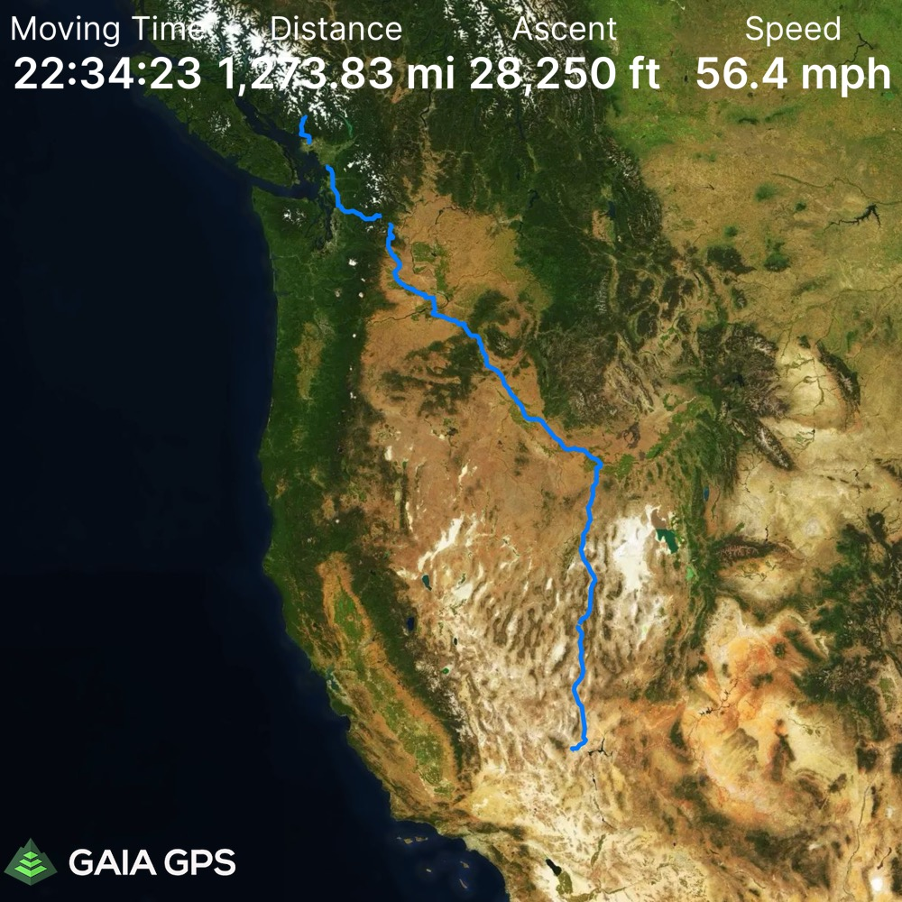
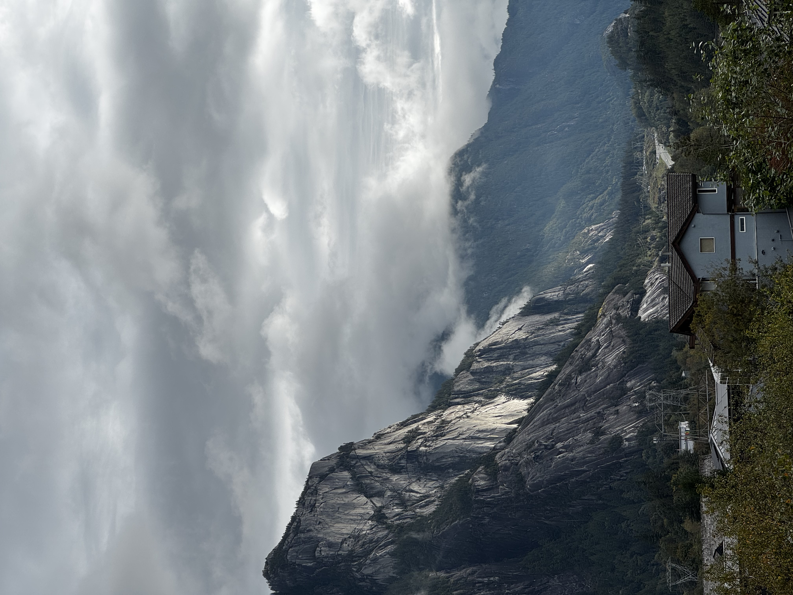
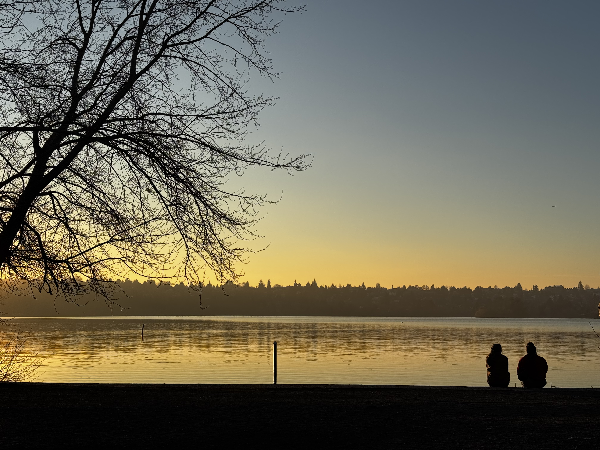

Last I wrote, I was packing up and setting out on a bit of an adventure. T. and I were heading to Squamish for the summer of 2024, then Smith Rock, then we were to make our way eastwards, searching for a city to land in.
By the end of our time in Squamish, we'd learned two things. One - we loved the PNW. I hope I can convey some of that love in my writing and photos. And two - balancing full time work, travel and climbing is _hard_. It feels strange to complain about that a year later from the comfort of a quick two week trip back to Squamish. Suffice to say the grass is always greener on the other side. I'd romanticized nomadic life, but the longer I Iived on the road the more I yearned for a place to put down roots. So we cut our eastward trip short. After Smith Rock we looped back up to Seattle. Maybe I'll write more about that period sometime. But in the meantime here are a few of my favorite images from that period.

TODO: implement captions
